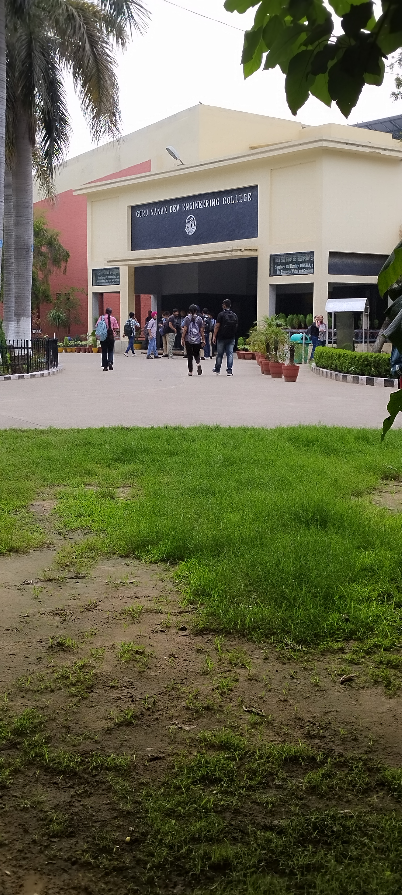

#### HARPREET KAUR  
Aspiring Electronics and Communication engineer  
  
### Education📒:  
- Completed 12th grade from Nankana Sahib Public School, Samrala
- Currently pursuing Electronics and Communication Engineering at Guru Nanak Dev Engineering College, Ludhiana

### Hobbies: 😄 
- Sketching and drawing 🖌️ ✏️
- Reading Book 📚

### Interests: ⭐ 
- Communication Networks🛰️📲 (focus area in ECE)
- Coding and programming💻

### Aspirations:  
- To become skilled Communication network engineer and contribute to the development of robust and efficient communication system.

### Current Engagement:
- Actively participating in the Induction Programme at Guru Nanak Dev Engineering College, Ludhiana - A Journey of Discovery!

I'm thrilled to share my exciting experience at the induction programme in our college.This programme has been a treasure trove of knowledge, inspiration, and growth. I'm thoroughly enjoying every moment of it and gaining valuable insights into my field.

The programme has featured an array of esteemed guests, respected owners, and experienced professionals who have shared their remarkable journeys, expertise, and wisdom. I've had the privilege of learning from their experiences and gaining clarity on various aspects of my field.

Through this programme, I've had the opportunity to join courses that align with my interests and career goals. I'm exploring new concepts, learning from industry experts, and developing skills that will shape my future.

The induction programme has been a perfect blend of knowledge sharing, interactive sessions, and networking opportunities. I'm grateful for this incredible experience, which has not only enhanced my understanding of my field but also inspired me to work towards my goals with renewed enthusiasm and confidence.

Thank you, Guru Nanak Dev Engineering College, for this amazing opportunity! I'm looking forward to continuing my journey of learning and exploration."  
 

#### 🌸THANK YOU FOR VISITING MY SITE.😊🙏 

